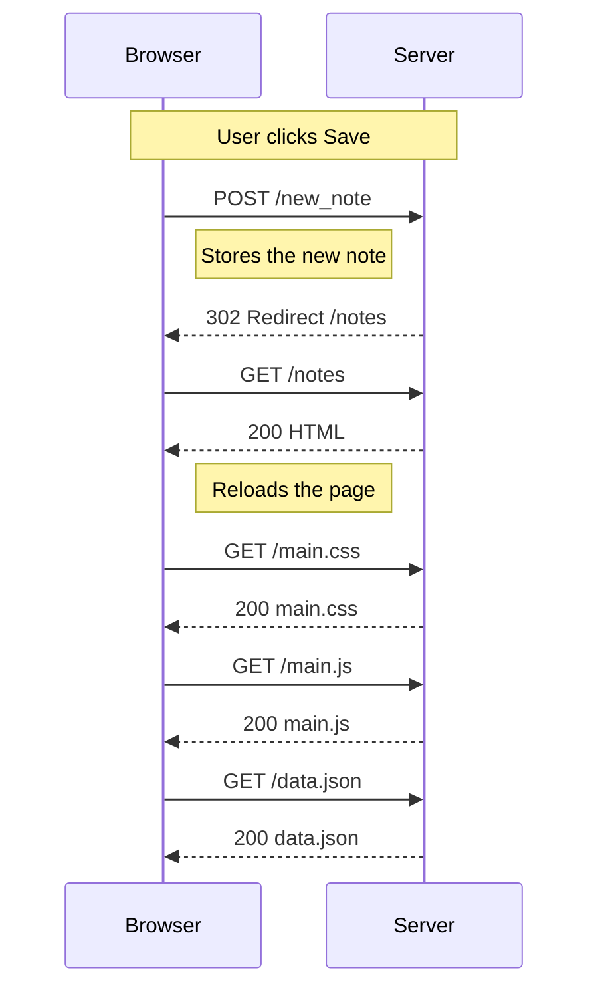
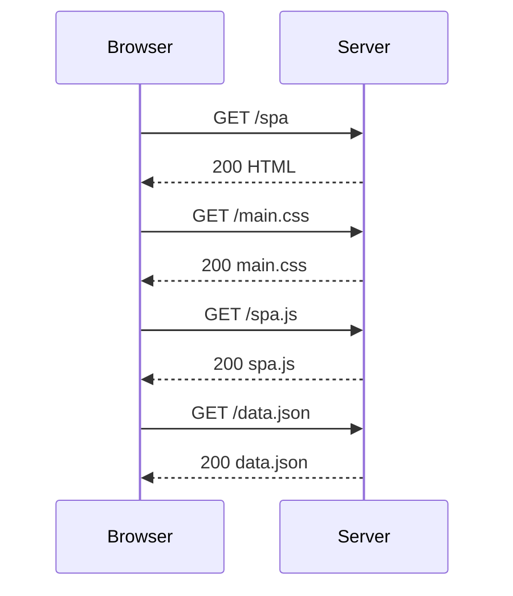
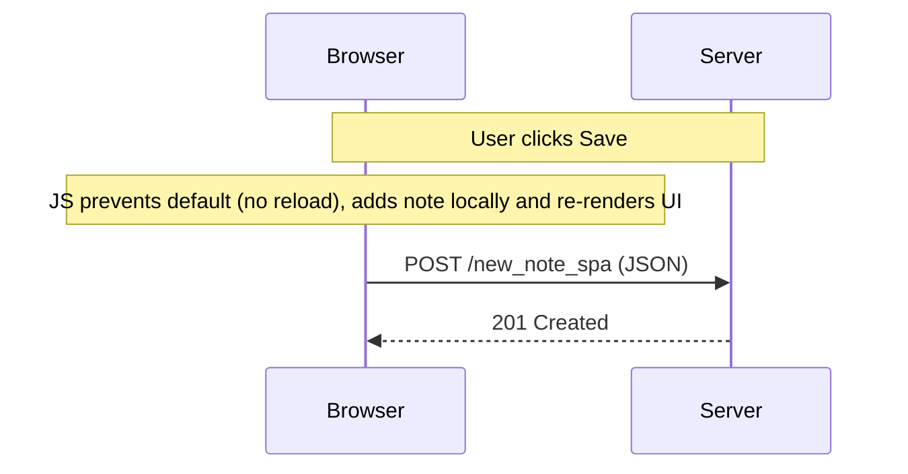

# fullstackopen
fullstackopen exercises

# Part 0 - Diagrams

## 0.4 New note (traditional)

```mermaid
sequenceDiagram
  participant Browser
  participant Server

Note over Browser, Server: User clicks Save
Browser ->> Server: POST /new_note
Note left of Server: Stores the new note
Server -->> Browser: 302 Redirect /notes
Browser ->> Server: GET /notes
Server -->> Browser: 200 HTML
Note right of Browser: Reloads the page
Browser ->> Server: GET /main.css
Server -->> Browser: 200 main.css
Browser ->> Server: GET /main.js
Server -->> Browser: 200 main.js
Browser ->> Server: GET /data.json
Server -->> Browser: 200 data.json
```

## 0.5 Single Page App

```mermaid
sequenceDiagram
  participant Browser
  participant Server

Browser ->> Server: GET /spa
Server -->> Browser: 200 HTML
Browser ->> Server: GET /main.css
Server -->> Browser: 200 main.css
Browser ->> Server: GET /spa.js
Server -->> Browser: 200 spa.js
Browser ->> Server: GET /data.json
Server -->> Browser: 200 data.json
```

## 0.6 New note (SPA)

```mermaid
sequenceDiagram
  participant Browser
  participant Server

Note over Browser, Server: User clicks Save
Note over Browser: JS prevents default (no reload), adds note locally and re-renders UI
Browser ->> Server: POST /new_note_spa (JSON)
Server -->> Browser: 201 Created
```
